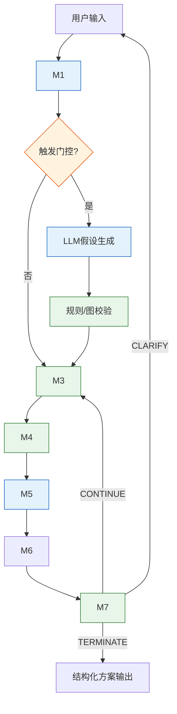

---
### 🌐 一、 架构全景视图



---

### 📦 二、 模块级 I/O 契约矩阵（逐节点清晰定义）

| 模块 | 定位 | 📥 Input（入参） | ⚙️ 核心逻辑范式 | 📤 Output（出参） | 🔧 技术范式 |
|:---|:---|:---|:---|:---|:---|
| **M1**<br>功能建模 | 事实提取底座 | `question: str`<br>`history: list[dict]` | LLM 提取 S-A-O、资源盘点、IFR 声明、初始信号；Schema 强校验 | `sao_list: list[SAO]`<br>`resources: dict`<br>`ifr: str`<br>`signals: list[str]` | `LLM(Call#1)` + `Pydantic校验` |
| **M2**<br>因果分析 | 根因校准（条件触发） | `sao_list: list`<br>`signals: list` | 门控触发 → LLM 生成候选链 → 规则/图校验收敛 → 过滤物理不可行项 | `triggered: bool`<br>`root_param: str\|None`<br>`key_problem: str`<br>`validated_chain: list` | `LLM(探索)` + `Python规则(收敛)` |
| **M3**<br>问题定型 | 题型分类（直连求解） | `sao_list`<br>`root_param`<br>`key_problem`<br>`signals` | 确定性分类树：基于对立事实/根因特征执行 `if-elif` 判定，输出求解目标 | `problem_type: Literal["tech","phys"]`<br>`contradiction_def: dict`<br>`solver_target: str` | `Python 确定性规则树` |
| **M4**<br>矛盾求解 | 符号确定性求解 | `contradiction_def: dict`<br>`solver_target: str`<br>`resources: dict` | **Tech**：参数映射 → 39矩阵查表 → 过滤<br>**Phys**：分离类型判定 → 原理映射 | `principles: list[int]`<br>`sep_type: str\|None`<br>`match_conf: float` | `SQLite查表` / `硬编码规则` |
| **M5**<br>方案生成 | 原理具象化迁移 | `principles: list`<br>`sep_type: str\|None`<br>`contradiction_def`<br>`resources`<br>`ifr` | `LLM_Gen` 独立实例：将抽象原理映射至领域场景，输出方案草稿（**不打分**） | `solution_drafts: list[SolutionDraft]`<br>（含 title, desc, applied_principles, resource_mapping） | `LLM(Call#2)` + `JSON约束` |
| **M6**<br>方案评估 | 独立评审与量化排序 | `solution_drafts: list`<br>`contradiction_def`<br>`resources`<br>`ifr`<br>`domain_context` | **M6_LLM**：独立实例执行 4 维定性打标（可行性/风险/IFR偏离/资源匹配）<br>**M6_Sym**：纯符号公式计算理想度 → 规则过滤 → 排序 | `ranked_solutions: list[Solution]`<br>`max_ideality: float`<br>`evaluation_metrics: dict` | `LLM(Call#3, 独立实例)` + `Python公式` |
| **M7**<br>收敛控制 | 迭代决策状态机 | `max_ideality: float`<br>`iteration: int`<br>`history_log: list`<br>`unresolved_signals: list` | 四重阈值判定：信号清空 / 停滞 / 收益递减 / 触达动态上限 → 输出控制指令 | `action: Literal["CONTINUE","TERMINATE","CLARIFY"]`<br>`reason: str` | `Python 状态机` + `统计规则` |

---

### 🔑 三、 核心数据结构定义（Pydantic 风格，可直接编码）

```python
class SAO(BaseModel):
    subject: str
    action: str
    object: str
    function_type: Literal["useful", "harmful", "excessive", "insufficient"]

class ContradictionDef(BaseModel):
    improve_param: Optional[str] = None
    worsen_param: Optional[str] = None
    param: Optional[str] = None
    need_state: Optional[str] = None
    need_not_state: Optional[str] = None
    evidence: list[str] = []

# M5 输出：生成草稿（只读，禁止自评）
class SolutionDraft(BaseModel):
    title: str
    description: str
    applied_principles: list[int]
    resource_mapping: str

# M6_LLM 输出：定性评估标签
class QualitativeTags(BaseModel):
    feasibility_score: int  # 1-5：技术可实现性
    resource_fit_score: int # 1-5：资源匹配度
    risk_level: Literal["low", "medium", "high", "critical"]
    ifr_deviation_reason: str

# M6 最终输出：量化排序方案
class Solution(BaseModel):
    draft: SolutionDraft
    tags: QualitativeTags
    ideality_score: float      # 确定性公式计算结果
    feasibility_flag: bool     # 硬规则拦截结果
    evaluation_rationale: str  # 公式代入摘要

# 全局上下文
class WorkflowContext(BaseModel):
    question: str
    sao_list: List[SAO] = []
    resources: Dict[str, List[str]] = {}
    ifr: str = ""
    signals: List[str] = []
    triggered_rca: bool = False
    root_param: Optional[str] = None
    key_problem: Optional[str] = None
    problem_type: Optional[Literal["tech", "phys"]] = None
    contradiction_def: Optional[ContradictionDef] = None
    solver_target: Optional[str] = None
    principles: List[int] = []
    solution_drafts: List[SolutionDraft] = []
    ranked_solutions: List[Solution] = []
    max_ideality: float = 0.0
    iteration: int = 0
```

---

### 🔁 四、 主链路与迭代控制流（生成/评估严格隔离）

```python
def run_triz_workflow(question: str, history: list[dict] = None):
    ctx = WorkflowContext(question=question)
    
    # 1. 事实底座固化（Call #1）
    ctx = M1_FunctionModeling(ctx, history)
    if not ctx.sao_list: return generate_clarification()
    
    # 2. 根因校准（条件触发）
    if M2_ShouldTrigger(ctx):
        ctx = M2_CausalAnalysis(ctx)
        
    # 3. 题型定型（确定性分类）
    ctx = M3_ProblemFormulation(ctx)
    
    # 迭代主循环（仅重跑 M3~M7，保护事实底座）
    while True:
        # 4. 确定性求解
        ctx = M4_ContradictionSolver(ctx)
        
        # 5. 方案生成（LLM_Gen 独立实例，Call #2）
        ctx.solution_drafts = M5_SolutionGeneration(ctx)
        if not ctx.solution_drafts: return generate_fallback()
        
        # 6. 方案评估（LLM_Eval 独立实例 + 符号内核，Call #3）
        ctx = M6_SolutionEvaluation(ctx)
        
        # 7. 收敛控制（状态机决策）
        decision = M7_ConvergenceControl(ctx)
        
        if decision.action == "TERMINATE":
            return format_final_output(ctx.ranked_solutions, decision.reason)
        elif decision.action == "CONTINUE":
            ctx.iteration += 1
            # 仅重跑 M3~M7，注入评估反馈调整参数映射
            ctx = M3_ProblemFormulation(ctx, feedback=decision.reason)
        elif decision.action == "CLARIFY":
            return generate_clarification(decision.missing_fields)
```

---

### 📌 五、 关键架构设计说明（回应您的核心诉求）

| 您的指令 | 架构落地实现 | 工程价值 |
|:---|:---|:---|
| **移除路由层** | M3 退化为确定性 `if-elif` 分类树，直接输出 `solver_target` 直连 M4。无评分、无状态机、无黑盒。 | 消除 v1.0 概率路由漂移，相同输入永远输出相同求解路径。 |
| **M5/M6 强制解耦** | M5 使用 `LLM_Gen (temp=0.3)` 专注创造性迁移；M6 使用 `LLM_Eval (temp=0.1)` 独立实例执行定性打标。M6 仅读取 M5 的只读草稿，绝不参与生成。 | 彻底打破“自生成自评估”幻觉循环，评估结果客观、可审计、可横向对比。 |
| **M6 评估不用纯符号** | 采用 `LLM_Eval 定性打标 → Python 符号公式量化` 混合范式。LLM 负责常识推理（可行性/风险/IFR偏离），符号负责理想度计算与排序。 | 兼顾工程上下文感知（符号盲区）与确定性量化（LLM盲区），守住落地底线。 |
| **迭代安全阀** | 仅重跑 M3~M7。M1/M2 的事实底座与根因声明固化不漂移。M7 依据客观阈值决策，保障有限步内收敛。 | 算力可控、逻辑可追溯、绝不无限循环。 |

---

>版本号：v1.0
>日期：2026.4.20

